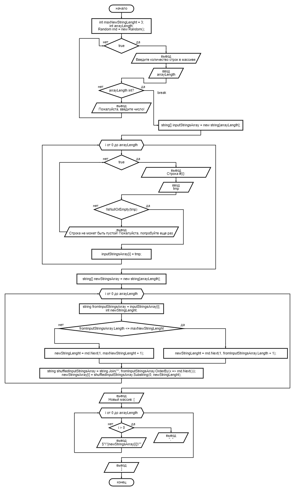

# Блок-схема

---
# Описание программы
## Инициализация переменных
```c#
int maxNewStringLenght = 3; - переменная с максимальной длиной новых генерируемых строк
int arrayLength; - переменная, в которую будет записана длина массива
Random rnd = new Random(); - экземпляр класса Random для генерации случайных чисел
```

## Ввод количества строк в массиве
В коде с 10 по 22 строчку запускается бесконечный цикл.
Выводим информацию о том, чтобы ввели количество строк в массиве.

Далее с помощью метода TryParse у типа int, пробуем получить число из введенной пользователем строки
```c#
if (int.TryParse(Console.ReadLine(), out arrayLength))
{
    break;
}
```
Если это число, функция вернет true и запишет введенное значение в переменную arrayLength, после чего с помощью конструкции break выходим из бесконечного цикла и идем дальше.

## Заполнение нового массива с клавиатуры
Инициализируем новый массив, размерностью arrayLength
```c#
string[] inputStringsArray = new string[arrayLength];
```

Далее создается цикл for i = 0 пока i < arrayLength
На каждой итерации мы запускаем бесконечный цикл и даем пользователю ввести новую строку
Если строка пустая, пользователю выводится сообщение "Строка не может быть пустой! Пожалуйста, попробуйте еще раз."
Если же строка не пустая, записываем это значение в ```inputStringsArray[i]```
```c#
for (int i = 0; i < arrayLength; i++)
{
    while (true)
    {
        Console.Write($"Строка #{i}: ");
        string tmp = Console.ReadLine();
        if (!string.IsNullOrEmpty(tmp))
        {
            inputStringsArray[i] = tmp;
            break;
        }
        Console.WriteLine("Строка не может быть пустой! Пожалуйста, попробуйте еще раз.");
    }
}
```

## Заполнение нового массива на основе старого
Инициализируем новый массив, соразмерный первому, а именно arrayLength
```c#
string[] newStringsArray = new string[arrayLength];
```

Далее создается цикл for i = 0 пока i < arrayLength
на каждой итерации которого мы проверяем длину строки из первого массива, и если длина меньше или равно maxNewStringLenght (в нашем случае 3), то с помощью метода Next из экземпляра класса Random - rnd мы генерируем новое число ```newStringLenght``` от 1 до maxNewStringLenght, (в функцию Next вторым аргументом передается maxNewStringLenght + 1, так как ОТ - включительно, а ДО 0 исключительно)

Далее строку из первого массива конструкцией ```string.Join("", fromInputStringsArray.OrderBy(x => rnd.Next()));``` мы строку сортируем рандомной генерацией чисел, тем самым "стряхивая" строку (по сути массив) и получая случайный порядок букв, функция OrderBy вернет массив, который с помощью string.Join мы склеиваем обратно и получаем цельную строчку.

Из полученной случайной строки, мы отрезаем функцией Substring ```newStringLenght``` (от 1 до 3) символов сначала и присваиваем полученную строку по индексу итератора в новый массив строк - ```newStringsArray```

```c#
for (int i = 0; i < arrayLength; i++)
{
    string fromInputStringsArray = inputStringsArray[i];
    int newStringLenght;
    if (fromInputStringsArray.Length <= maxNewStringLenght)
    {
        newStringLenght = rnd.Next(1, fromInputStringsArray.Length + 1);
    }
    else
    {
        newStringLenght = rnd.Next(1, maxNewStringLenght + 1);
    }
    string shuffledInputStringsArray = string.Join("", fromInputStringsArray.OrderBy(x => rnd.Next()));
    newStringsArray[i] = shuffledInputStringsArray.Substring(0, newStringLenght);
}
```

## Вывод получившегося массива
Выводится строка ```"Новый массив: ["```
Создается цикл размерностью arrayLength (размер первого полученного массива и второго)
В теле цикла проверяем индекс итерации i, и если больше 0 (НЕ первый элемент), то выводим ```", "``` запятую с пробелом
Далее независимо от индекса выводим значение по индексу итератора из нового полученного массива ```newStringsArray[i]```
После цикла выводим закрывающую квадратную скобку
```c#
Console.Write("Новый массив: [");
for (int i = 0; i< arrayLength; i++)
{
    if (i > 0)
    {
        Console.Write(", ");
    }
    Console.Write($"\"{newStringsArray[i]}\"");
}
Console.Write("]");
```
